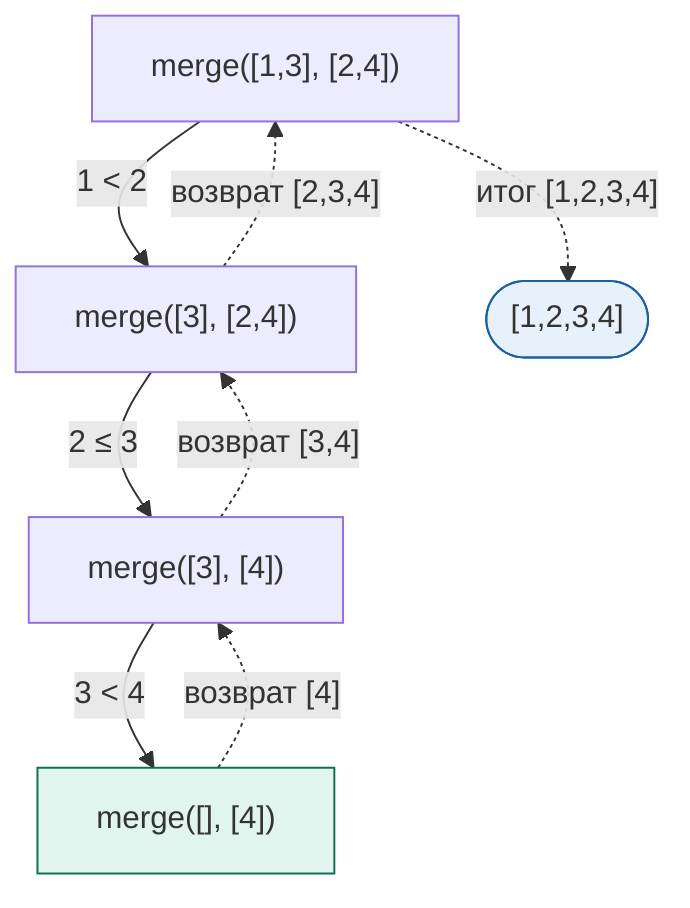
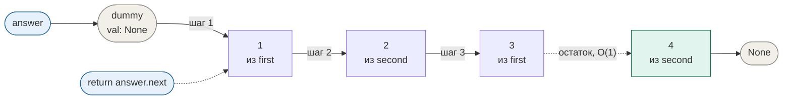

## Объяснение решения

Вкратце я сделал так:
StrategyOfMerging - абстрактный класс, типо как интерфейс в Go, в котором я подготовил метод merging_algorythm. Метод, который я буду переопределять в дочерках - а там уже будут понятные алгоритмы.
MergeSimple - класс под решение без фиктивного элемента. По сути просто рекурсия, которая собирает мне односвязный список по заданным мною условиям. Ничего сложного думаю.
MergeWithFictitious - класс под доп элементик. Вкратце ты рожаешь пустой элемент, у меня это empty, чтобы в конечном итоге вернуть empty.next, который будет ссылаться на голову общего отсортированного списка. А сама сортировка просто цикл.

## Оценка сложности

## 1

### MergeSimple

### Скорость

1) a - количество элементов в первом списке
2) b - количество элементов во втором списке
O(a+b) - во всех случаях
В лучшем O(min(a,b)) - когда один список супер быстро кончился и второй я просто по ссылке добавил за O(1).

### Память

O(a+b) - алгоритм сам не требует памяти, но поскольку мы каждый раз вызываем merge_two_linked, то в stack frame на каждый уровень рекурсии кладутся first,second как ссылки.

## Визуализация

## 2

### MergeWithFictitious

### Скорость, я - СКОРОСТЬ

1) a - количество элементов в первом списке
2) b - количество элементов во втором списке

O(a+b) - внутри реализации merging_algorythm вызывается preproc,
который строит оба связных списка за O(a+b), это и задаёт оценку на самом деле.
Сам цикл слияния делает не больше min(a,b) итераций: он прекращается,
как только один список кончился, а остаток второго цепляется
одним присваиванием за O(1).

### Память есть

O(1) - дополнительной, не считая узлов из preproc, но я препроцессинг вобще не считаю.

## Визуализатион

Вход: first = [1,3], second = [2,4]

Серым фиктивный узел, он в результат не попадает.
Зелёным остаток, прицепленный целиком одним присваиванием.

| Шаг | Сравнение | Взяли из | Результат | first | second |
| ----- | ----------- | ---------- | ----------- | ------- | -------- |
| старт | | | `dummy` | `[1,3]` | `[2,4]` |
| 1 | 2 >= 1 | first | `[1]` | `[3]` | `[2,4]` |
| 2 | 2 < 3 | second | `[1,2]` | `[3]` | `[4]` |
| 3 | 4 >= 3 | first | `[1,2,3]` | `[]` | `[4]` |
| остаток | first пуст | second целиком | `[1,2,3,4]` | `[]` | `[]` |

Цикл прекратился после трёх итераций, хотя элементов четыре:
последний прицепился за O(1) вместе со своим хвостом.
