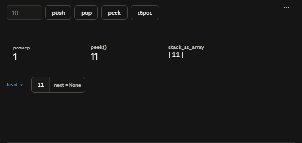
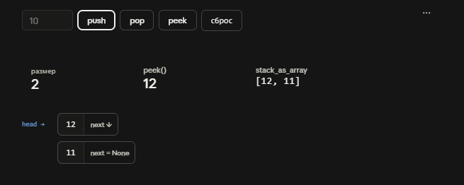
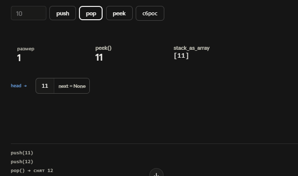
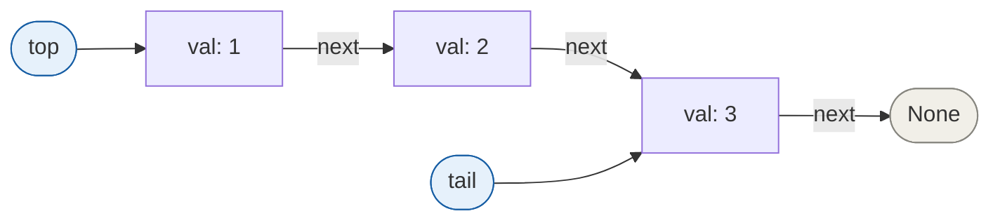

## Объяснение решения

Вообще хотел реализацию на Golang сделать, но решил, что динамическая типизация более интересна для показа.
Вкратце на отдельные файлы разнёс реализацию очереди, стека и узла в односвязном списке.
Стек реализован вообще как дефолтный LinkedList с обращением к голове. Буквально stack, где head всегда на последнего пришедшего указывает.

Очередь тоже самое, только теперь top указывает на первого пришедшего,а tail на последнего.
И реализовал проверки на corner case, когда у меня что-то может быть пустым.

## Оценка сложности

## 1

### Stack

### Скорость

```python
    push()           - O(1), создать новый узел, подложить в начало, прикрепить ссылку на старую голову
    pop()            - O(1),просто head перенести на следующий
    peek()           - O(1), как peek() только я просто показываю что к чему
    stack_as_array() - O(n), поскольку тут нужно пройтись по всему стеку
```

### Память

```python
    push()           - O(1), создание нового узла
    pop()            - O(1), сборщик мусора вообще освобождает память
    peek()           - O(1), без комментариев 
    stack_as_array() - O(n), выделили место под список из всех элементов стека
```

## Визуализация





## 2

### Queue

### Скорость?

```python
    enqueue()        - O(1), создать узел, прицепить к tail.next, сдвинуть tail
    dequeue()        - O(1), прочитать val, сдвинуть top на next, при опустошении обнулить tail
    silent_dequeue() - O(1), то же самое без чтения значения
    peek()           - O(1), один разыменованный указатель top
    reverse_peek()   - O(1), один разыменованный указатель tail
    array_perform    - O(n), обход всей очереди от top до конца
```

### Память есть

```python
    enqueue()        - O(1) один новый узел
    dequeue()        - O(1) ничего не выделяется
    silent_dequeue() - O(1) без дополнительной памяти
    peek()           - O(1) тут тоже пусто
    reverse_peek()   - O(1) и здесь нет
```

У array_perform как и у стек - O(n) [память есть](https://www.youtube.com/watch?v=OPxhAFZFuLg), список из всех элементов.

## Визуализация очереди


