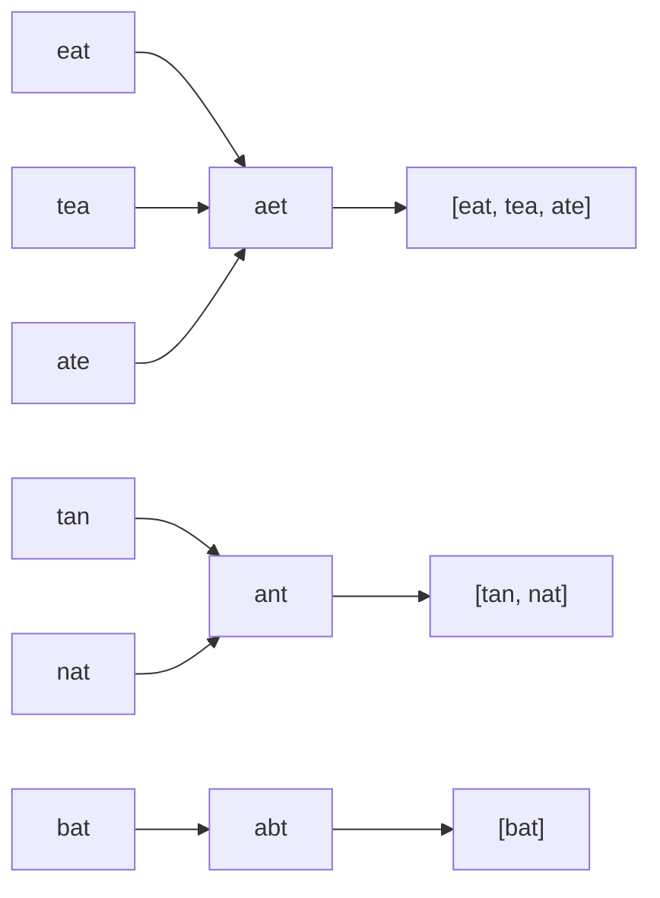

# Объяснение решения

Просто итерируемся по исходному массиву со строками.
Видем строку. Раскладываем её по элементам в список, сортируем список, собираем.
Получаем некоторый ключ, который будет подходить под все строчки с одинаковыми элементами.
Типо "aza" - ключ "aaz" и сюда подойдёт "zaa" тоже.
В конце просто возвращаем все зн-я в нужном отсортированном порядке.

## Оценка сложности

`n` — количество слов, `k` — длина самого длинного слова.

### Скорость

O(n · k log k) - для каждого из `n` слов сортируем буквы за `O(k log k)`.

### Память

O(n · k) - в словаре хранятся все исходные слова и ключи длиной до `k`.

## Визуализация

### Пошаговый проход

`strs = ["eat", "tea", "tan", "ate", "nat", "bat"]`

| слово | ключ   | действие       | словарь после шага                                         |
|-------|--------|----------------|------------------------------------------------------------|
| eat   | aet    | новая группа   | {aet: [eat]}                                               |
| tea   | aet    | добавили       | {aet: [eat, tea]}                                          |
| tan   | ant    | новая группа   | {aet: [eat, tea], ant: [tan]}                              |
| ate   | aet    | добавили       | {aet: [eat, tea, ate], ant: [tan]}                         |
| nat   | ant    | добавили       | {aet: [eat, tea, ate], ant: [tan, nat]}                    |
| bat   | abt    | новая группа   | {aet: [eat, tea, ate], ant: [tan, nat], abt: [bat]}        |

Результат: `[["eat", "tea", "ate"], ["tan", "nat"], ["bat"]]`

### Слова → ключи → группы

