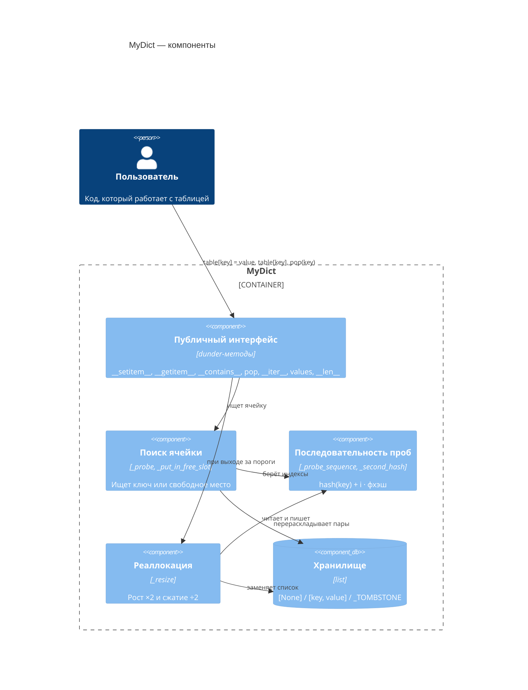
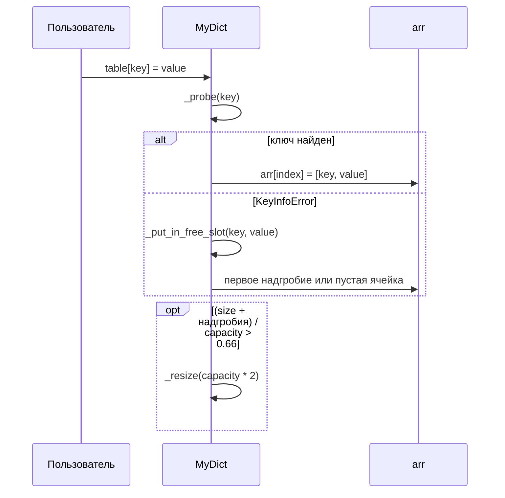

# Объяснение решения

Вот тут конечно пришлось попотеть мозгами.
Делал единичным списком - открытая адресация.
Алгоритм решения коллизий - двойное хэширование.
Где второе хэширование реализовано через алгоритм [Фибоначчи](https://probablydance.com/2018/06/16/fibonacci-hashing-the-optimization-that-the-world-forgot-or-a-better-alternative-to-integer-modulo/).(Далее фхэш)
Идея такая:
В функцию фхэш приходит дефолтный hash() Python по ключу.
Далее

1. Умножаем хэш на константу `2^64 / φ ≈ 11400714819323198485` .
   Константа нечётная: при умножении на чётное число младший бит всегда ноль, и мы теряли бы информацию.
2. Маскируем результат `& (2^64 − 1)`. В C при таком умножении число переполнилось бы и само обрезалось до 64 бит, а в Python `int` безразмерный, поэтому переполнение эмулировал.
3. Сдвигаем вправо на `64 − k`, где `capacity = 2^k`. Остаются верхние `k` бит — число от `0` до `capacity − 1`. Берём именно верхние, потому что при умножении переносы идут снизу вверх, и в старших битах собирается влияние всех битов хэша.
4. Делаем `| 1`: шаг становится нечётным. Это главное требование ко второй хэш-функции:
   нечётное число не бывает нулём (иначе стояли бы на месте) и взаимно просто с `2^k`,
   поэтому последовательность проб обходит все ячейки таблицы.
   Например, при `capacity = 16` шаг `2` обошёл бы только 8 ячеек из 16, а шаг `3` — все 16.

В остальном в реализации ещё вписал реаллокацию на сжатие и расширение, основываясь на load_factor
и манипулируя capacity. Переопределил ещё некоторые dunder-методы, чтобы обращение по ключу было как у реальной dict() ==> типо вот `hehe[key] = value`. Также когда эл-т удаляется, то я ставлю надгробие, чтобы пробы продолжались,а не падали на середине пути.

## Оценка сложности

`n` — количество элементов в таблице, `α` — заполненность, у нас `α ≤ 0.66`.

### Скорость

| операция        | в среднем               | в худшем |
|-----------------|-------------------------|----------|
| вставка         | O(1) амортизированно    | O(n)     |
| поиск по ключу  | O(1)                    | O(n)     |
| удаление        | O(1) амортизированно    | O(n)     |

- **Поиск.** Ожидаемое число проб при двойном хэшировании: для найденного ключа примерно
  `(1/α) · ln(1/(1−α))`, для отсутствующего — примерно `1/(1−α)`.
  При `α = 0.66` это около 1.6 и 3 проб — отсюда O(1).
- **Вставка.** Два прохода, каждый O(1) в среднем.
  Иногда срабатывает расширение за O(n), но из-за удвоения оно редкое,
  и на одну вставку в среднем приходится O(1) — это и есть «амортизированно».
- **Удаление.** Поиск + установка надгробия за O(1). Сжатие за O(n) срабатывает редко
  благодаря разнесённым порогам, там реалок при 0.26.

### Память

**O(n).** Пороги держат заполненность между ~0.26 и 0.66, поэтому `capacity`
не превышает примерно `4n`.
Дополнительная память на поиск и удаление — O(1).

## Визуализация

### Устройство (C4, уровень компонентов)



### Вставка `table[key] = value`



### Работа на примере

Показаны только нужные ячейки. Пусть ключи `A`, `B` и `C` стартуют со слота 3,
шаг у `A` и `C` не важен, у `B` шаг 5.

#### 1. Вставили A и B — коллизия

```text
слот:   3          8
       [A, 1]     [B, 2]
        ↑          ↑
        A лёг      B: слот 3 занят → 3 + 5 = 8
```

#### 2. Удалили A — ставим надгробие

```text
слот:   3          8
       TOMBSTONE  [B, 2]
```

Если бы тут стала пустая ячейка `[None]`, цепочка до `B` оборвалась бы.

#### 3. Ищем B — надгробие пропускаем

```text
слот 3: TOMBSTONE → идём дальше
слот 8: [B, 2]    → нашли, возвращаем 2
```

#### 4. Вставляем C — переиспользуем надгробие

```text
проход 1 (_probe):             ключа C нет — дошли до пустой ячейки
проход 2 (_put_in_free_slot):  первое свободное место — слот 3

слот:   3          8
       [C, 3]     [B, 2]
```

Надгробие снова занято, счётчик надгробий уменьшился на 1.
